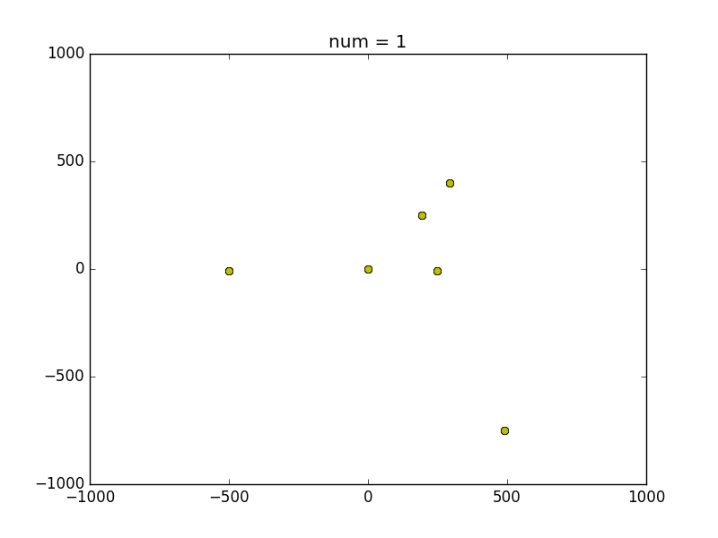

# これはなに？
シンプルな、天体の運動シミュレーション＆可視化プログラムです。
https://github.com/sk2sat/planet を元に作りました。
simはシミュレーションプログラム(sim.cppをコンパイルしたもの)、plot.pyは可視化プログラムです。

# 使い方
```
git clone https://github.com/asanotigaku/planet.git
cd planet
mkdir out
./autoexec.sh
```

# 依存するライブラリ
plot.py: matplotlib, numpy (Python 3.5)

# 動作画面

2D


3D
[3D-SAMPLE](https://www.youtube.com/watch?v=zRT2A6eBkLQ)
